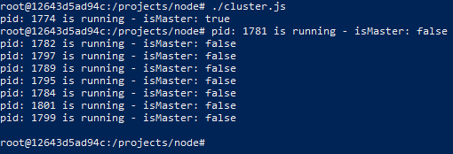
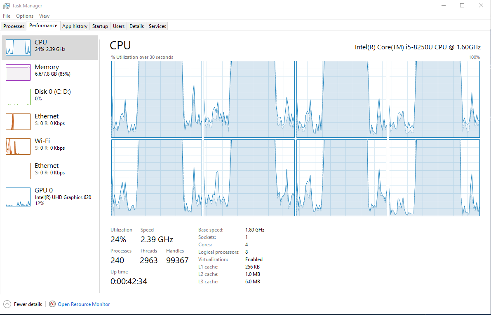
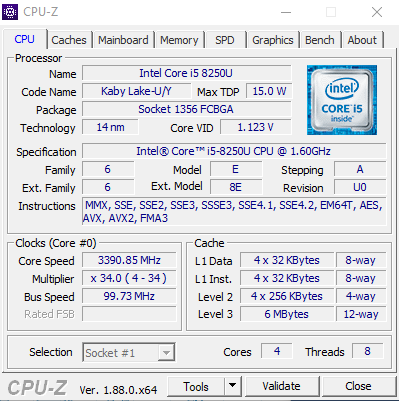

# node
Exercise cluster API to show all cores being maxed out

Intel i5 8250U

## 8 cores
Shell execution of Node JS application.

Task manager showing the mathematics running with one process on each core.

## CPU-Z
